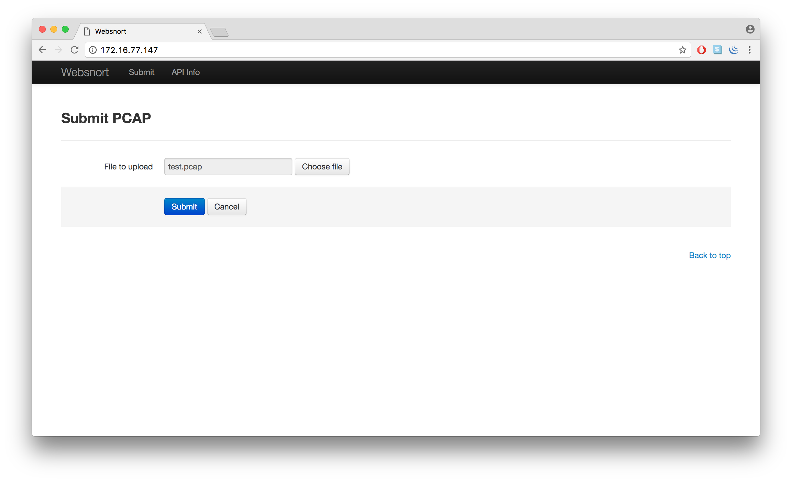
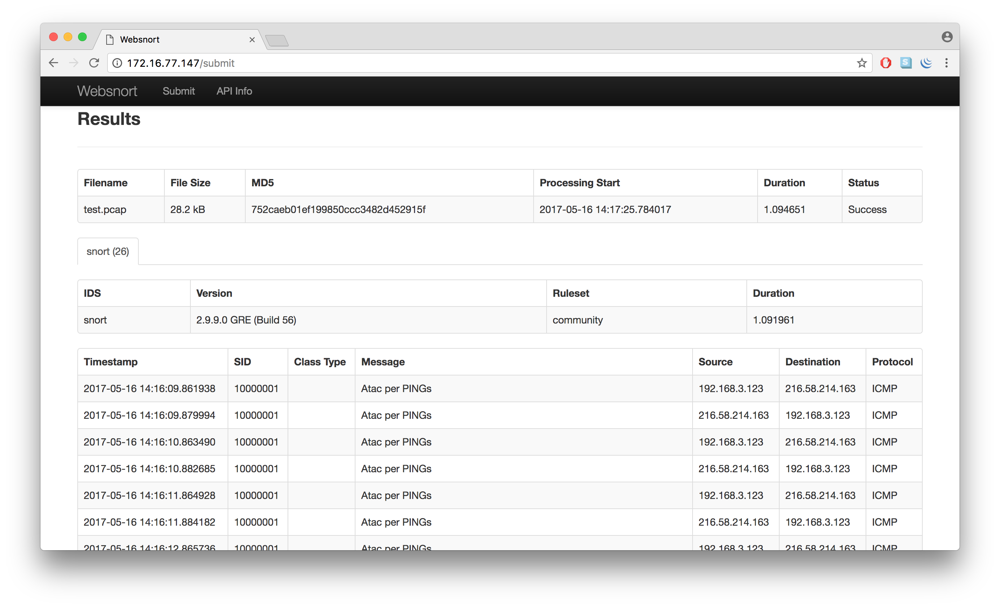
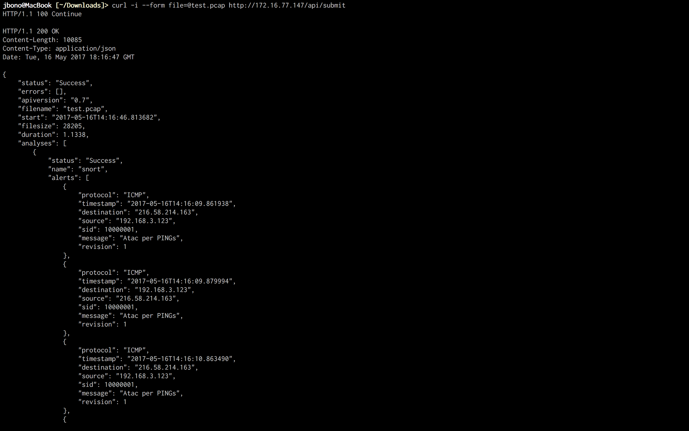

# Snorter 

Tricky script which mades Snort installation simply as a script execution is. The script installs:

+ [Snort](https://snort.org/): Open Source IDS.
+ [Barnyard2](https://github.com/firnsy/barnyard2): Interpreter for Snort unified2 binary output files.
+ [PulledPork](https://github.com/shirkdog/pulledpork): Snort rule management.
+ [WebSnort](https://github.com/shendo/websnort): Web Interface for PCAP analysis.

Successfully tested in:

+ Raspberry Pi + Raspbian Jessie
+ Kali Linux Rolling Release
+ Debian 8.5

***

## Installation

Detailed install [instructions](https://github.com/joanbono/Snorter#install-instructions).

### Download

Simply run on your terminal:

~~~~bash
git clone https://github.com/joanbono/Snorter.git
cd Snorter/src
~~~~

### Execution

Printing the USAGE:

~~~~bash
bash Snorter.sh -h
~~~~

OR

~~~~bash
bash Snorter.sh --help
~~~~

RECOMMENDED: Executing the script using an [OINKCODE](https://www.snort.org/oinkcodes)

~~~~bash
bash Snorter.sh -o <oinkcode> -i <interface>
~~~~

***

## Docker
### Edit the Dockerfile

Dockerfile content. Use your personal [OINKCODE](https://www.snort.org/oinkcodes).

~~~~
#Kali docker with SNORT + BARNYARD2 + PULLEDPORK
#Version 0.1.0
From kalilinux/kali-linux-docker:latest
MAINTAINER Joan Bono <@joan_bono>

ENV OINKCODE
ENV INTERFACE

RUN apt-get update && apt-get upgrade -y && apt-get install -y git curl wget
RUN git clone https://github.com/joanbono/Snorter.git /opt/Snorter
RUN /opt/Snorter/src/Snorter.sh -o ${OINKCODE} -i ${INTERFACE}
USER root
WORKDIR /opt/Snorter
~~~~

### Run the dockerfile

Start the `docker` daemon.

+ With `websnort`:

~~~~
cd Snorter/src/
docker build SnorterDock -p 80:80 -e OINKCODE=<oinkcode> -e INTERFACE=<interface>
~~~~

+ Without `websnort`:

~~~~
cd Snorter/src/
docker build SnorterDock -e OINKCODE=<oinkcode> -e INTERFACE=<interface>
~~~~

***

## WebSnort Usage

+ Submit a `pcap` using the web browser:

+ Watch the `alerts` on the web browser:

+ Submit a `pcap` using the `API`:

~~~~
curl -i --form file=@test.pcap http://ADDRESS/api/submit
~~~~

***

## Add Service on Kali Linux

The service creation is not working on Kali Linux. To add `Snorter` as a service on Kali Linux just create a new file `/lib/systemd/system/snort.service` containing:

~~~~
[Unit]
Description=Snort NIDS Daemon
After=syslog.target network.target
 
[Service]
Type=simple
ExecStart=/usr/local/bin/snort -q -u snort -g snort -c /etc/snort/snort.conf -i eth0
 
[Install]
WantedBy=multi-user.target
~~~~

Then you have to activate the service as follows:

~~~~
systemctl enable snort.service
systemctl start snort.service
~~~~

Finally, in order to check if `Snorter` is running:

~~~~
snort.service - Snort NIDS Daemon
   Loaded: loaded (/lib/systemd/system/snort.service; enabled; vendor preset: disabled)
   Active: active (running) since Thu 2017-05-18 13:15:11 BST; 7min ago
 Main PID: 586 (snort)
   CGroup: /system.slice/snort.service
           └─586 /usr/local/bin/snort -q -u snort -g snort -c /etc/snort/snort.conf -i eth0

May 18 13:15:11 dima systemd[1]: Started Snort NIDS Daemon.
~~~~

Thanks to [`@dimaspencer84`](https://github.com/dimaspencer84), for solving this problem.

***

## Install Instructions

+ English: [PDF](doc/Instructions_EN.pdf)  -  [MarkDown](doc/doc_EN.md)
+ Spanish: [PDF](doc/Instructions_ES.pdf)  -  [MarkDown](doc/doc_ES.md)
+ Catalan: [PDF](doc/Instructions_CA.pdf)  -  [MarkDown](doc/doc_CA.md)

***

## Special thanks to

+ [@goffinet](https://github.com/goffinet) for the rule enabler and for solving solving the `systemctl` issue.
