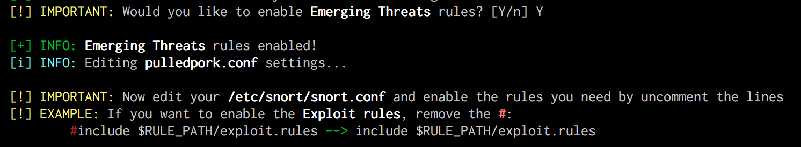

<!-- $theme: default -->

# Snorter
## Install Guide

Install `Snort` + `Barnyard2` + `PulledPork` automatically 

[@joan_bono](https://twitter.com/joan_bono)

---

## What do you need?

- A computer running:
	- **Debian**
	- **Kali Linux** 
	- **Raspbian Jessie**
- Oinkcode:
	- It's **FREE**! :wink:
	- Highly recommended!
	- Get yours [here](https://www.snort.org/oinkcodes).
- Identified Network Interface:
	- `ip link show `
- Previous dependencies:
	- `sudo apt-get install git` 
- Patience.

---

## First steps

- Cloning the repository:
~~~bash
git clone https://github.com/joanbono/Snorter.git` 
cd Snorter/src
bash Snorter.sh -h
~~~

- **Recommended**: Execute the program using an **oinkcode** 
~~~bash
bash Snorter.sh -o <oinkcode> -i <interface>
Ex: bash Snorter.sh -o XXXXXXXXXXXXX -i eth0
~~~

- **Not Recommended**: Execute the program without an **oinkcode** 

~~~bash
bash Snorter.sh -i interface
bash Snorter.sh -i eth0
~~~

---

## `Snort` installation

+ Superuser password, and wait...
 

---

+ `Snort` and `daq` are installed.

---

+ Now it's time to add the `HOME_NET` and the `EXTERNAL_NET`.

+ Press `Enter` to continue. It will open `vim`:
	+ Press `A` to go to the end of the line.
	+ Add the address and the mask you want to protect.
	+ Press `Esc` and then `:wq!` to save the changes.

---

+ Do the same for the `EXTERNAL_NET`:

+ Press `Enter` to continue. It will open `vim`:
	+ Press `A` to go to the end of the line.
	+ Add the *attacker* address. **Recommeded**: `!$HOME_NET`.
	+ Press `Esc` and then `:wq!` to save the changes.

---

+ Now the **output**. By default, `unified2` output is enabled, but you can enable more than one output. I'm going to enable both **CSV** and **TCPdump** output.

---

+ Now `SNORT` will start in `console` mode. Send a `PING` from another machine. 

+ It will show a `PING` alert. Press `Ctrl+C` **once**, and continue the installation.

---

## `Barnyard2` installation

+ Now it's time to install `BARNYARD2` if you want.
+ You will be asked to insert a password for the `SNORT` database which is going to be created. In the example, I've used `SNORTSQL`

---

+ Now the program will install dependencies. 
+ It's going to install `MySQL`, so if it's not installed, you will insert a password for this service too. In the example, I've used `ROOTSQL`.

---

+ And the `MySQL` password.

---

+ Now you are going to be asked for the `MySQL` password **3 times**
+ Please keep in mind: **`MySQL` `root` password 3 times**.

---

## `PulledPork` installation

+ Now it's time to install `PulledPork` if you want.

---

## **Emerging Threats** ruleset

+ Do you want to add the **Emerging Threats** rules and the **community** ones (enabled by default)?

+ **Remember** to edit your `/etc/snort/snort.conf` and remove the **`#`** to enable the rules you want or the ones you need.

---

## `service` creation

+ Create a system `service`:

---

## Download and install new rules

+ You can download rules when everything is installed and configurated.

---

## Reboot

+ Reboot the system.

---

# Enjoy!

> Please, feel free to open **issues** if you have any problem with the program.
