<!-- $theme: default -->

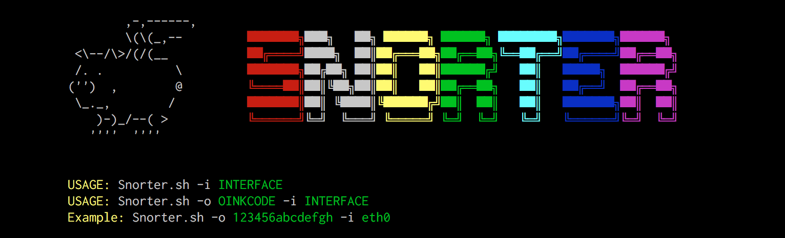

# Snorter
## Guia d'Instal·lació

Instal·la `Snort` + `Barnyard2` + `PulledPork` automàticament

[@joan_bono](https://twitter.com/joan_bono)

---

## Què necessites?

- Un ordinador amb:
	- **Debian**
	- **Kali Linux** 
	- **Raspbian Jessie**
- Oinkcode:
	- És **GRATUÏT**! :wink:
	- Molt recomanable
	- Obtenir el teu [aquí](https://www.snort.org/oinkcodes).
- Interfície de xarxa identificada:
	- `ip link show `
- Dependències prèvies:
	- `sudo apt-get install git` 
- Paciència.

---

## Primeres passes

- Clonar el repositori:
~~~bash
git clone https://github.com/joanbono/Snorter.git` 
cd Snorter/src
bash Snorter.sh -h
~~~

- **Recomanat**: Executa el programa fent servir un **oinkcode** 
~~~bash
bash Snorter.sh -o <oinkcode> -i <interface>
Ex: bash Snorter.sh -o XXXXXXXXXXXXX -i eth0
~~~

- **No Recomanat**: Executa el programa sense cap **oinkcode** 

~~~bash
bash Snorter.sh -i interface
bash Snorter.sh -i eth0
~~~

---

## Instal·lació de `Snort`

+ Contrassenya de superusuari, i esperar...
 

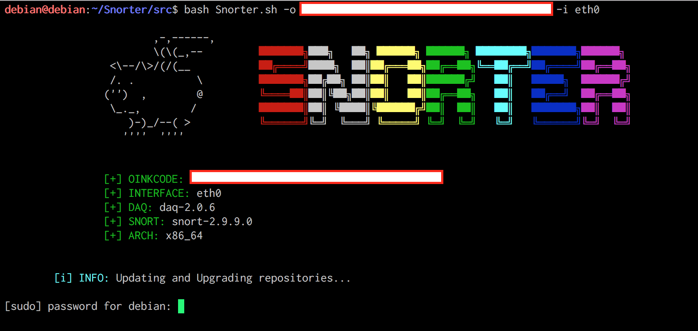

---

+ `Snort` i `daq` s'han instal·lat.

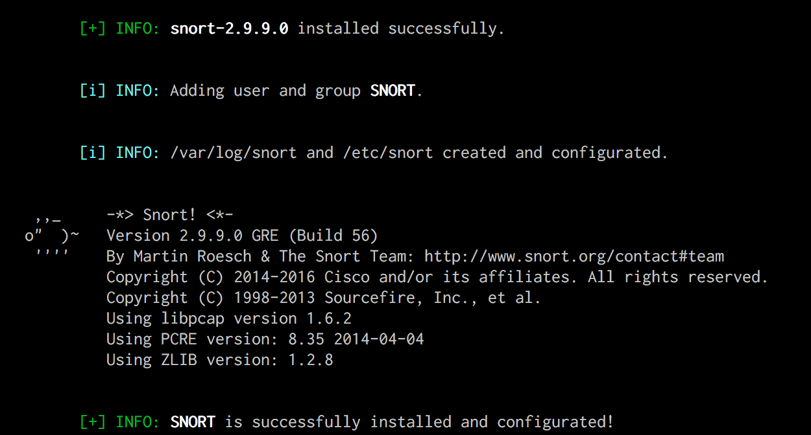

---

+ Ara toca afegir la `HOME_NET` i la `EXTERNAL_NET`.

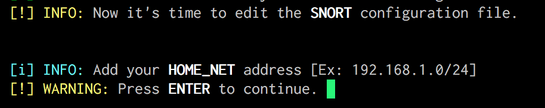

+ Prémer `Intro` per continuar. Obrirà `vim`:
	+ Prémer `A` per anar al final de la línia.
	+ Afegeix l'adreça i la màscara de la xarxa a protegir.
	+ Prémer `Esc` i després `:wq!` per desar canvis.

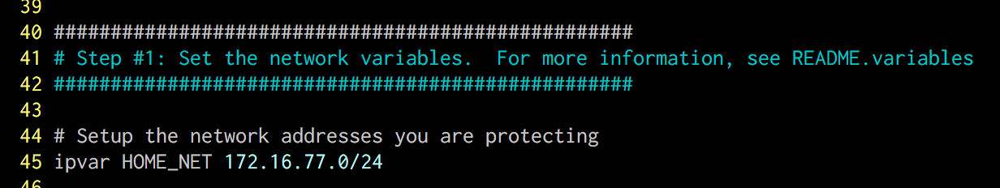

---

+ Fes el mateix per a la `EXTERNAL_NET`:

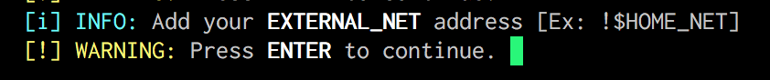

+ Prémer `Intro` per continuar. Obrirà `vim`:
 	+ Prémer `A` per anar al final de la línia.
	+ Afegir l'adreça *atacant*. **Recomanat**: `!$HOME_NET`.
	+ Prémer `Esc` i després `:wq!` per desar canvis.

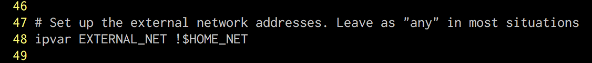

---

+ Ara la **sortida**. Per defecte, s'habilita el format de sortida `unified2`, però pots habilitar més d'una sortida. Vaig a habilitar la sortida en **CSV** i format **TCPdump**.

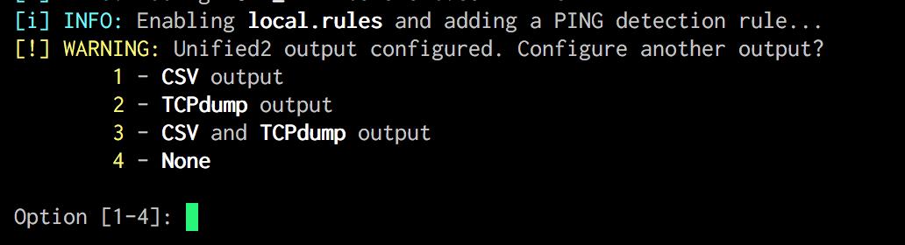

---

+ Ara `SNORT` arrancarà en mode `consola`. Mana un `PING` des d'altra màquina per comprovar el funcionament. 

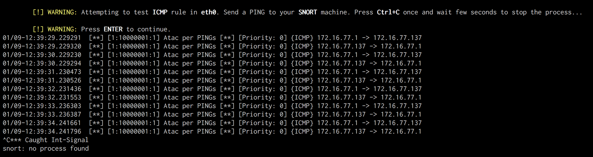

+ Mostrarà una alerta de `PING`. Prémer `Ctrl+C` **una vegada**, i continua la instal·lació.

---

## Instalació de `Barnyard2`

+ Ara toca instal·lar `BARNYARD2` si vols.
+ Es demana inserir una contrassenya per la base de dades de `SNORT` que es va a crear. En l'exemple utilitzo `SNORTSQL`.

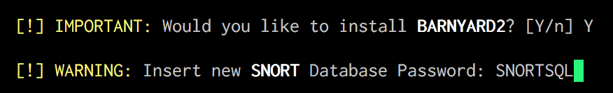

---

+ Ara el programa instal·larà algunes dependències.
+ Instal·larà `MySQL`, si no està instal·lat prèviament, hauràs d' introduïr una contrassenya de `root`. En l'ejemplo, poso `ROOTSQL`.

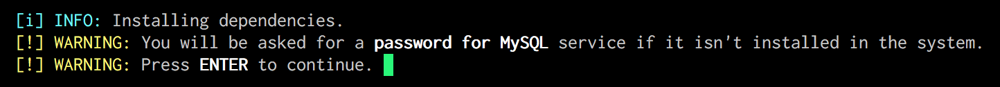

---

+ I la contrassenya del servei `MySQL`.

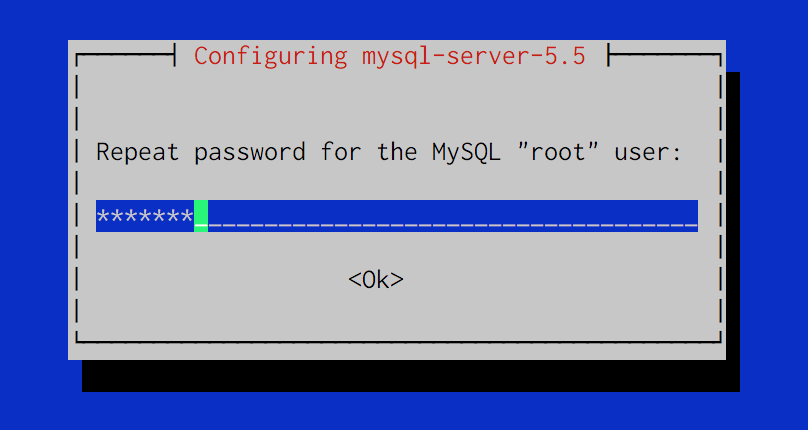

---

+ Ara el programa pregunta la contrassenya de `MySQL` **3 vegades**
+ Tenir en compte: contrassenya **`root`** de **`MySQL` 3 vegades**.

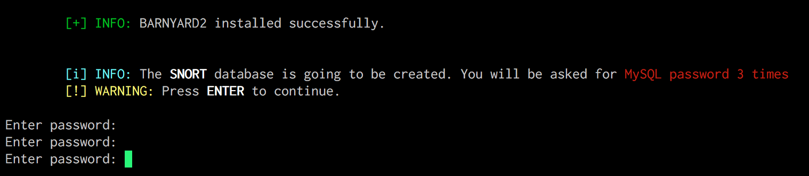

---

## Instal·lació de `PulledPork`

+ Ara toca instal·lar `PulledPork` si vols.

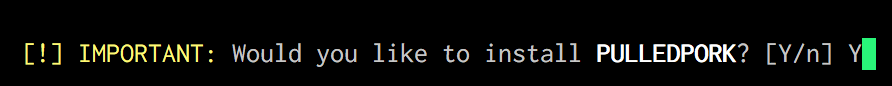

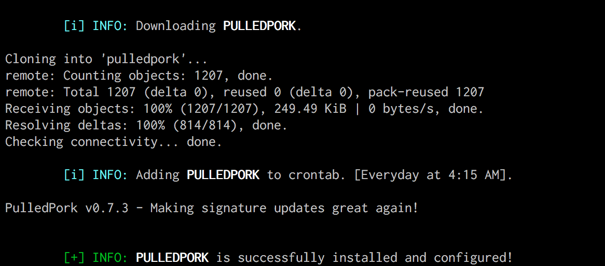

---

## Crear un `servei`

+ Crear un `servei` del sistema:

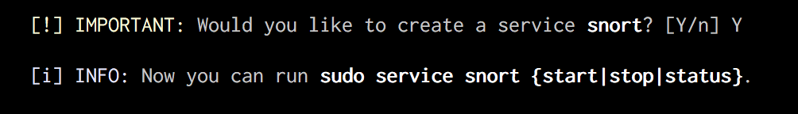

---

## Descarregar i instal·lar noves regles

+ Pots descarregar i instal·lar noves regles quan tot estiga instal·lat i configurat.

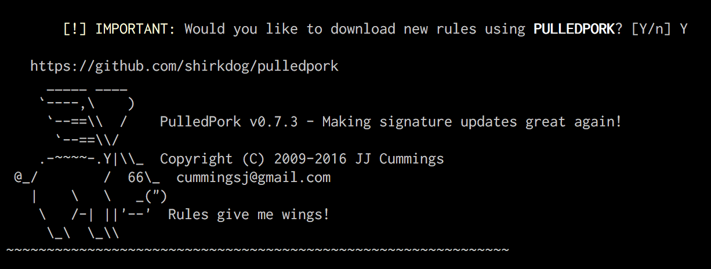

---

## Habilitar regles `Emerging Threats` i `Community` 

+ Habilitar automàticamente al `snort.conf` les regles d'`Emerging Threats` i `Community`

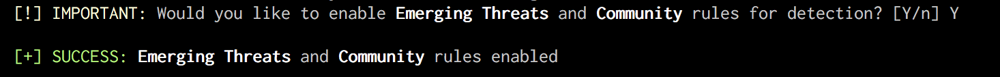

---

## WebSnort

+ Instal·lar WebSnort per analitzar `PCAPs`

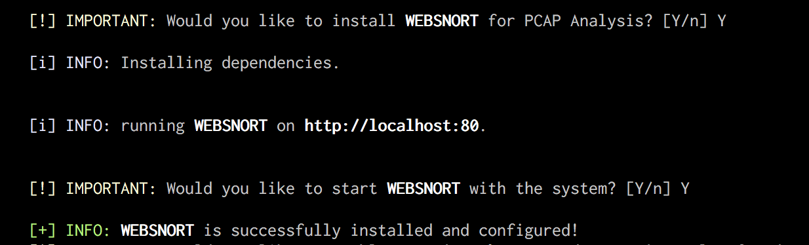

---
## Reiniciar

+ Reiniciar el sistema.

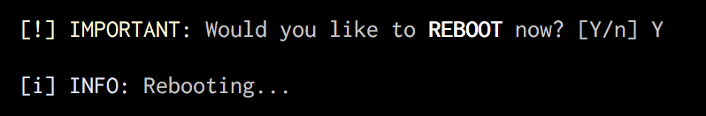
